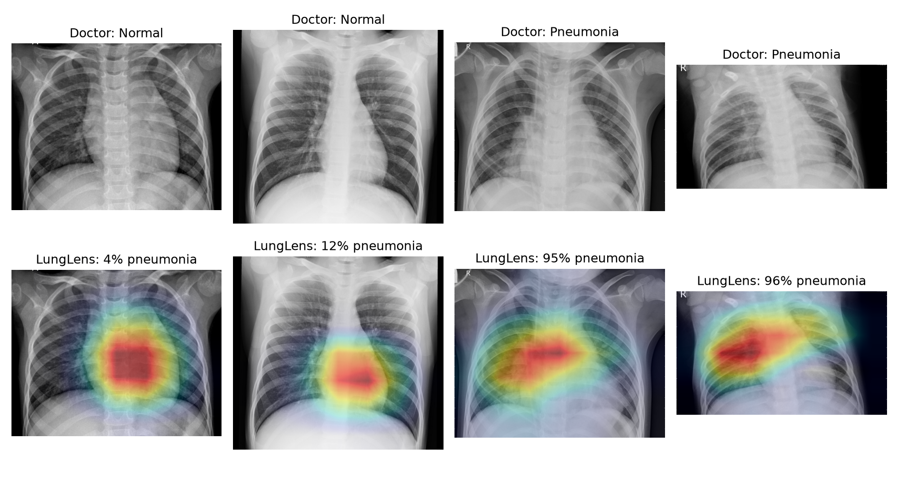

# 🫁 LungLens

**See what the AI sees.** Explainable chest X-ray screening for earlier pneumonia detection.

LungLens is a web app that looks at a chest X-ray and, in a few seconds, says how
likely it is that the patient has pneumonia. It also draws a **Grad-CAM heatmap**
over the X-ray showing which regions drove that decision, so a doctor can check
the AI's reasoning instead of trusting a black box.

Built for the UnivaBio hackathon (theme: AI for Human Health).

> ⚠️ **Screening aid, not a diagnosis.** LungLens is a student research prototype.
> It must not be used to make medical decisions.

## Results

Measured on the 624 test X-rays, which were never used for training or tuning:

| Metric | Value |
|---|---|
| Accuracy | 90.1% |
| Sensitivity (pneumonia cases caught) | 98.5% |
| Specificity (healthy X-rays correctly cleared) | 76.1% |
| AUC | 0.955 |



## How it works

1. **Data:** 5,856 chest X-rays of children aged 1 to 5, labelled NORMAL or
   PNEUMONIA by physicians (Kermany et al., *Cell* 2018, CC BY 4.0).
2. **Model:** a DenseNet121 convolutional neural network, pretrained by the
   [TorchXRayVision](https://github.com/mlmed/torchxrayvision) project on
   hundreds of thousands of adult chest X-rays, with a new final layer that
   outputs one number: the probability of pneumonia.
3. **Training:** only the last dense block and the new layer are fine-tuned,
   for 5 epochs on a CPU. Validation patients are held out by patient ID, the
   loss is weighted for the 3:1 class imbalance, and the alert threshold is
   chosen on validation data to balance sensitivity and specificity.
4. **Explainability:** Grad-CAM uses the gradients flowing into the network's
   last 7×7 feature maps to score how much each region of the X-ray mattered.
5. **App:** a Streamlit page where you upload an X-ray (or pick a sample) and see
   the verdict, probability and heatmap side by side.

## Project files

| File | What it does |
|---|---|
| `prepare_data.py` | Step 1. Downloads the dataset and unpacks it into image folders |
| `dataset.py` | Loads images and makes the patient-level train/validation split |
| `network.py` | The neural network and the image preprocessing |
| `train.py` | Step 2. Fine-tunes the network and saves `models/lunglens.pt` |
| `evaluate.py` | Step 3. Measures the model on the test set, saves charts to `results/` |
| `gradcam.py` | Builds the Grad-CAM heatmap and the coloured overlay |
| `app.py` | Step 4. The interactive web app |
| `samples/` | Six test-set X-rays for trying the app |
| `docs/` | One-page description, code PDF, demo video script, code walkthrough |

## Run it yourself

You need Python 3.10 or newer.

```bash
pip install -r requirements.txt

# Just run the app (uses the trained model in models/):
streamlit run app.py

# Or reproduce everything from scratch:
python prepare_data.py   # downloads about 1.2 GB
python train.py          # about 85 minutes on a 4-core CPU
python evaluate.py
streamlit run app.py
```

## Limitations

- Trained on young children from a single hospital in China; performance on
  adults or on X-rays from other hospitals and machines is unknown.
- Only two classes (normal and pneumonia). It does not detect other conditions.
- Grad-CAM heatmaps are coarse (7×7 grid) and show where the model looked,
  not a medical outline of the infection.

## Credits

- Dataset: Kermany, D. S. et al. "Identifying Medical Diagnoses and Treatable
  Diseases by Image-Based Deep Learning." *Cell* 172(5), 2018.
- Pretrained weights: Cohen, J. P. et al. "TorchXRayVision: A library of chest
  X-ray datasets and models." MIDL 2022.
- Grad-CAM: Selvaraju, R. R. et al. "Grad-CAM: Visual Explanations from Deep
  Networks via Gradient-based Localization." ICCV 2017.
